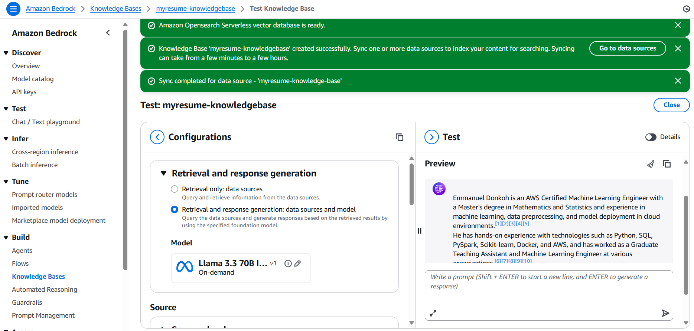
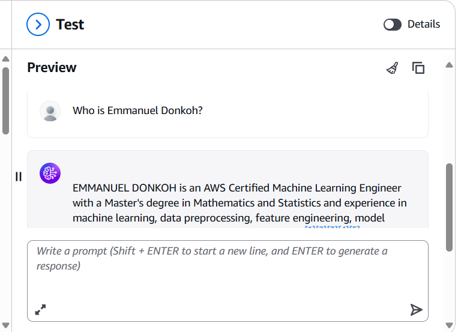
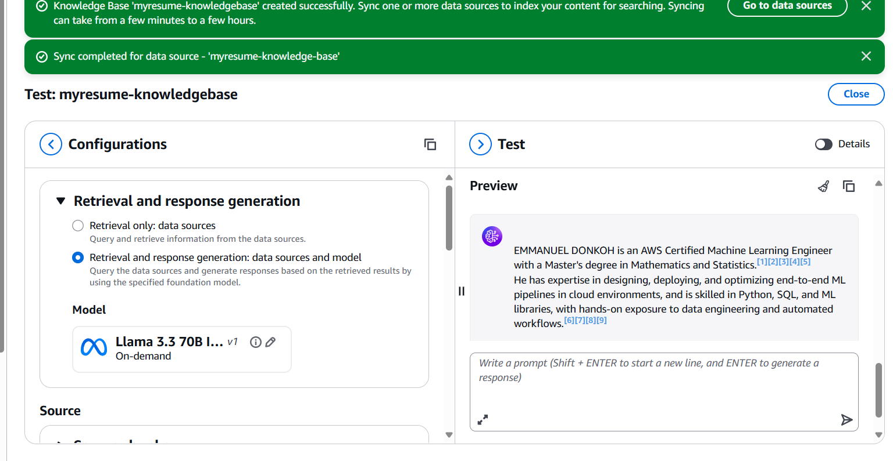
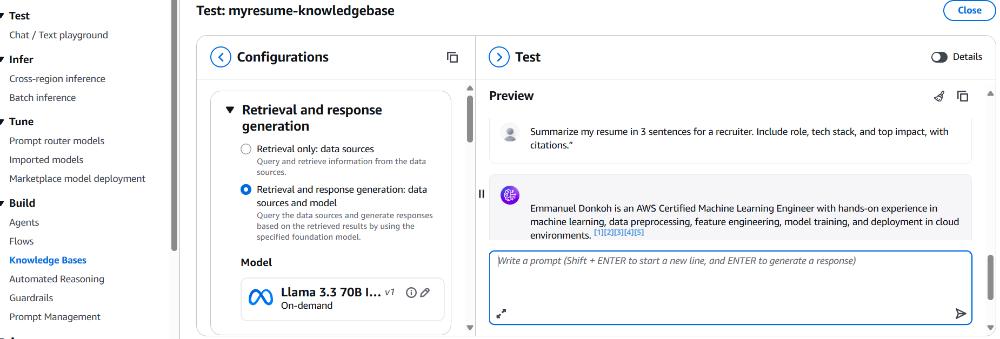
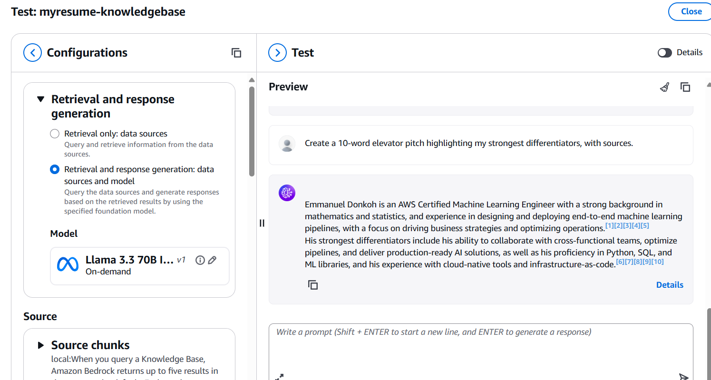

# Set Up a RAG Chatbot in Bedrock

**Author:** Nana Penod  
**Email:** emmanueldonkoh335@gmail.com

## Set Up a RAG Chatbot in Bedrock

## Screenshots
**KB created & synced**  

**“Who is Emmanuel Donkoh?” — grounded answer**  

**3-sentence recruiter summary with citations**  

**Concise summary with inline citations**  

**10-word elevator pitch from resume**  

## Why Bedrock?
- Fully managed retrieval + generation with native **S3**, **OpenSearch Serverless**, and **Knowledge Bases**.  
- Grounded outputs: answers cite the specific resume chunks used.  
- Scales without managing vector DB infrastructure.

## Reproduce
1. Upload documents to **S3** (same region as Bedrock).  
2. **Bedrock → Knowledge Bases**: create KB → S3 data source → OpenSearch Serverless vector store → **Titan Text Embeddings v2**.  
3. **Sync** to ingest, chunk, and embed.  
4. Test with **Llama 3.3 70B Instruct** in *Retrieval & generation* mode.  
5. Ask recruiter-style prompts and verify citations.

## Notes
- If a question is unanswered, add/adjust documents or chunking settings and re-sync.  
- Toggle **Generate responses** off to view only retrieved sources.

© 2025 Nana Penod

## Introducing Today's Project!

RAG (Retrieval Augmented Generation) is an AI framework that combines a large language model with an external knowledge retriever to generate more accurate and context-aware responses. In this project, I will demonstrate RAG by integrating Amazon Bedrock’s foundation model with a vector database to retrieve relevant documents and enhance chatbot outputs. The goal is to show how RAG improves reliability and grounding in answers compared to using the language model alone.

### Tools and concepts

Services I used were Amazon Bedrock, Amazon S3, and OpenSearch Serverless. Key concepts I learnt include how to build a Retrieval-Augmented Generation (RAG) pipeline, configure chunking and embeddings, and connect a Knowledge Base for efficient document retrieval. I also gained practical experience in syncing data, testing AI models, and troubleshooting chatbot performance.

### Project reflection

This project took me approximately a few hours to complete from setup to testing. The most challenging part was configuring the Knowledge Base and troubleshooting issues with AI model responses. It was most rewarding to see the chatbot successfully retrieve information and generate accurate, context-aware answers.

I did this project today to gain hands-on experience with building a Retrieval-Augmented Generation (RAG) chatbot using Amazon Bedrock. This project helped me understand how to integrate services like S3, embeddings, and OpenSearch into a functional AI workflow. Yes, it met my goals by giving me practical skills in deploying scalable, knowledge-grounded chatbots.

## Understanding Amazon Bedrock

Amazon Bedrock is a fully managed service that allows me to build and scale generative AI applications using foundation models from top providers without managing infrastructure. I'm using Bedrock in this project to orchestrate a RAG-based chatbot that retrieves and generates responses from my custom knowledge base. It offers seamless integration with S3 and vector stores, ensuring secure, scalable, and low-latency AI-powered interactions.

My Knowledge Base is connected to S3 because S3 is a scalable and durable storage service ideal for hosting large volumes of unstructured data. In this project, I’m using S3 to store the documents and files that serve as source material for my chatbot. This setup allows Amazon Bedrock to retrieve relevant content directly from the S3 bucket for real-time, grounded responses.

In an S3 bucket, I uploaded documents that contain the reference material and knowledge sources my chatbot will use to generate accurate responses. My S3 bucket is in the same region as my Knowledge Base because this ensures lower latency, faster access, and reduced data transfer costs. Keeping them aligned in the same region also simplifies integration and improves overall system performance.

## My Knowledge Base Setup

My Knowledge Base uses a vector store, which means it can efficiently store and search embeddings to find the most relevant documents for a query. When I query my Knowledge Base, OpenSearch will perform similarity searches across the stored vectors to return the closest matches. I’m using OpenSearch Serverless because it is fully managed, scalable, and optimized for low-latency vector search without requiring infrastructure management.

Embeddings are vector representations of text that capture semantic meaning, enabling similarity search between queries and documents. The embeddings model I’m using is Titan Text Embeddings v2 because it offers high accuracy, scalability, and is optimized for retrieval-augmented generation tasks. This ensures my chatbot can quickly find and reference the most relevant information from the Knowledge Base.

Chunking is the process of breaking large documents into smaller, manageable pieces so they can be efficiently indexed and retrieved. In my Knowledge Base, chunks are set to optimize both context size and retrieval accuracy, ensuring the AI gets the most relevant portions of text. This configuration improves the chatbot’s ability to provide precise, context-aware answers.

## AI Models

AI models are important for my chatbot because they enable it to understand natural language, generate human-like responses, and adapt to different contexts. Without AI models, my chatbot would only retrieve raw text from documents without interpreting or summarizing the information. With AI, the chatbot can combine retrieval with reasoning to deliver accurate, conversational, and user-friendly answers.

To get access to AI models in Bedrock, I had to explicitly enable the foundation models I wanted to use in my AWS account. AWS needs explicit access because each model is provided by different providers and may have usage, compliance, and cost considerations. This process ensures secure, controlled access while allowing me to select only the models that best fit my chatbot’s requirements.

## Syncing the Knowledge Base

Even though I already connected my S3 bucket when creating the Knowledge Base, I still need to sync because the data hasn’t actually been ingested yet. Syncing moves the documents from S3 into the Knowledge Base, where they can be chunked and embedded for retrieval. This step ensures that the chatbot has access to the most up-to-date information for accurate responses.

The sync process involves three steps: first, the documents from S3 are ingested into the Knowledge Base. Second, the ingested documents are chunked into smaller sections to make them easier to search and retrieve. Third, embeddings are generated for each chunk and stored in the vector database, enabling efficient similarity search during chatbot queries.

## Testing My Chatbot

I initially tried to test my chatbot using Llama 3.1 8B as the AI model, but it was better suited for lightweight tasks and simpler responses. I had to switch to Llama 3.3 70B because it provides more advanced reasoning, handles complex queries, and generates higher-quality outputs. Using the larger model ensures the chatbot delivers more accurate and context-aware answers for challenging questions.

The chatbot could not answer the question because the required information is not available in its Knowledge Base. It gave me this response: "The search results do not contain information about making a cup of tea."

You can also turn off the Generate Responses setting to make the chatbot return only the retrieved documents without creating an AI-generated answer. When it is turned on, the AI model will use the retrieved content to generate a conversational response. This toggle gives flexibility to either view raw source material or receive a natural language answer.

## Upgrading My Chatbot

